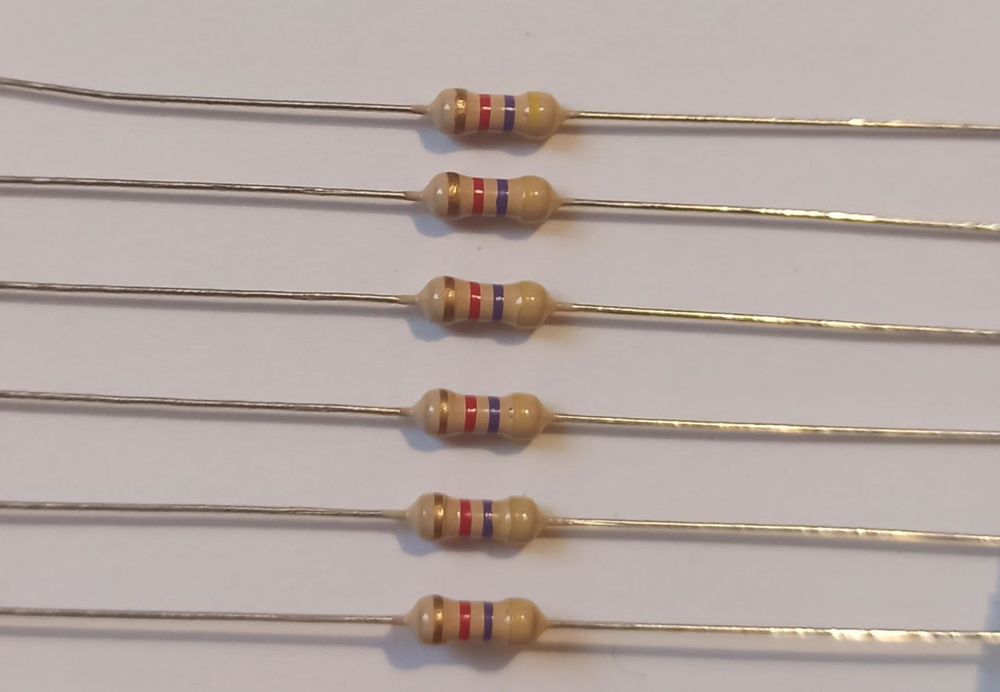
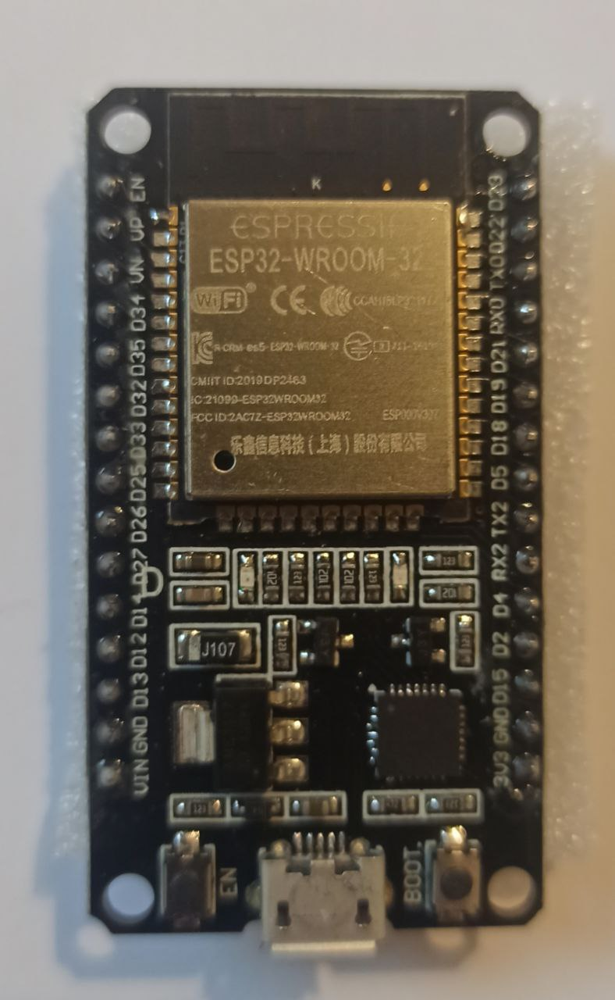
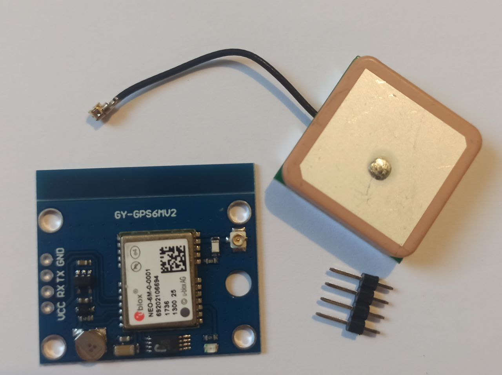
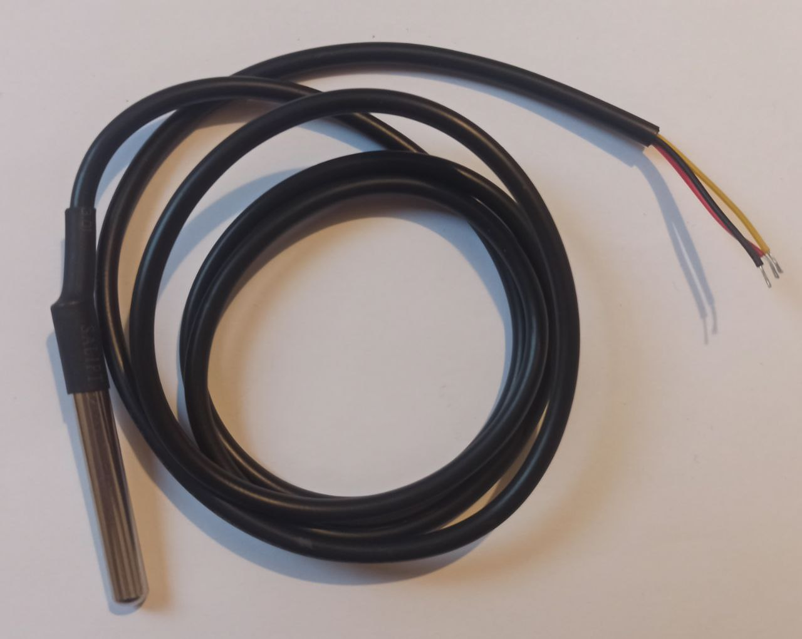
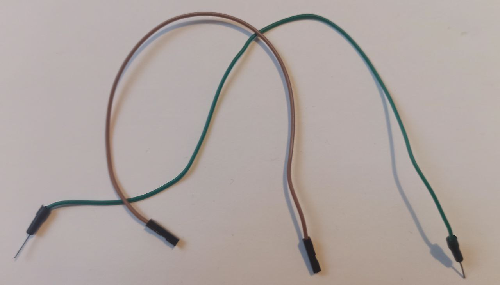
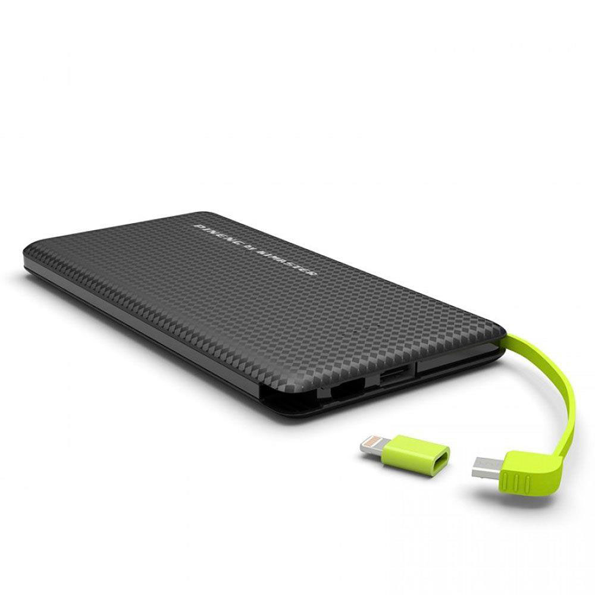
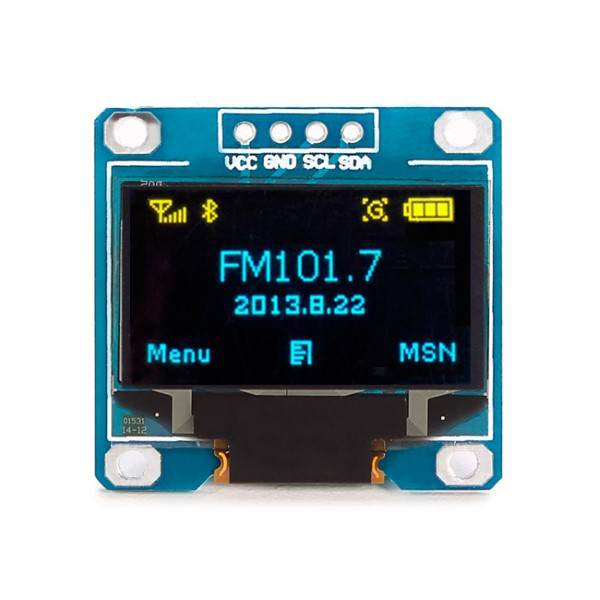

# Module Description
The module IoT we built is responsible for collecting temperature and GPS position of the vaccines. The device is device on ESP32 board.

This document describes the steps to produce the sensor.

# 1 - Hardware and tools: what do you need?
## Hardware
- ESP32 Dev Module
- GPS Module GY-NEO6MV2
- Temperature sensor Ds18b20
- Power Bank
- Wire Jumper (male/female)
- Resistor 4.7K $\mathsf{k\Omega}$
- 0.96 OLED Display Module 128x64 (controller SSD1306)

## Tools
- Soldering Iron and tin
- Protoboard/Breadboard
- Multimeter
- Screwdriver (phillips also)

# 2- Software: what do you need to install?
Software used to build and deploy code on the ESP32.

## a. Installing Arduino IDE
You need to install Arduino IDE to deploy code on ESP32. Arduino IDE also supports other boards. 

- Link for Arduino IDE --> https://www.arduino.cc/en/software

## b. Installing the driver to allow communication with ESP32
Now, install the driver to allow your computer to communicate with ESP32 through Arduino IDE.

- Link for the driver (support for multiple operating systems): https://www.silabs.com/developers/usb-to-uart-bridge-vcp-drivers

- **Tip:** This step is a precaution for the next steps. Sometimes when you install Arduino IDE, you are not able to see the port where the ESP32 is connected. Installing the driver allow you to see this port, and connect with ESP32.

## c. Installing the support for ESP32 on Arduino
With Arduino IDE, you need to install the support for ESP32. Follow the tutorial to test if the connection with ESP32 works.

- **Tutorial:** https://randomnerdtutorials.com/installing-the-esp32-board-in-arduino-ide-mac-and-linux-instructions/

- **Important link:** https://dl.espressif.com/dl/package_esp32_index.json

- **Tip:** the output on Arduino IDE sometimes presents garbled characters because your output might be in a different frequency compared to the board. Link --> https://stackoverflow.com/questions/17893792/arduino-garbled-serial-output . The baud on the Arduino IDE output has to be equal to the begin, both with 115200.

## Images of the hardware
<!--  -->

ESP32

 

GPS Sensor GY-NEO6MV2

 

Temperature sensor Ds18b20

 

4.7K Resistor

 

Wires Jumpers

 

Power Bank

 

Display OLED 0.96

 
 
 

**NEXT MODULE -->** [Building the sensor](https://github.com/caroljunq/builders-fair-2021-e-l-s-a/blob/main/iot/2-building-sensor-device-esp32.md)