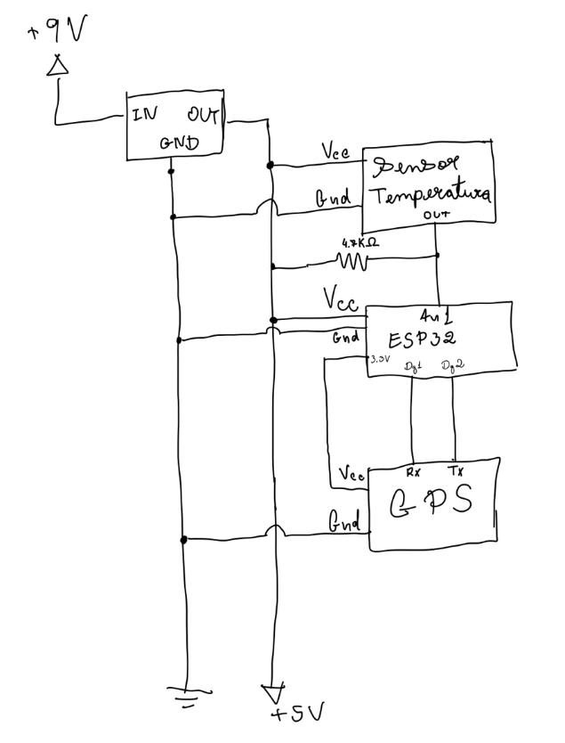
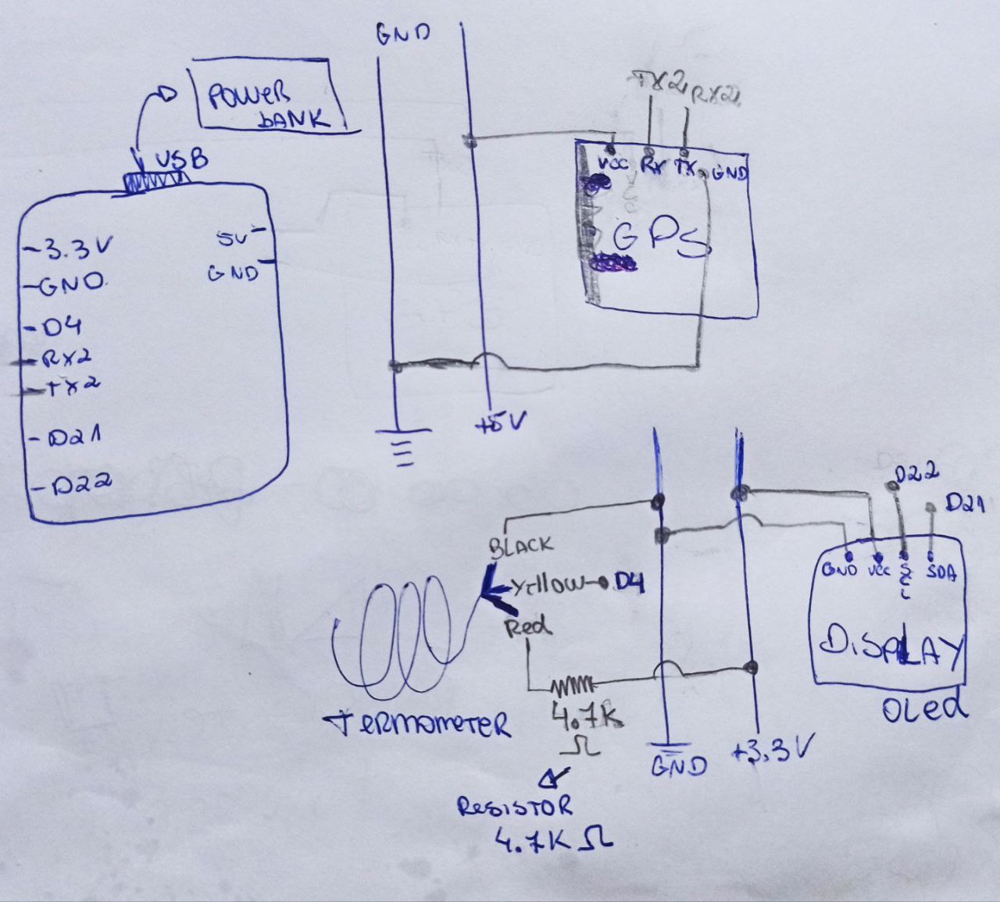
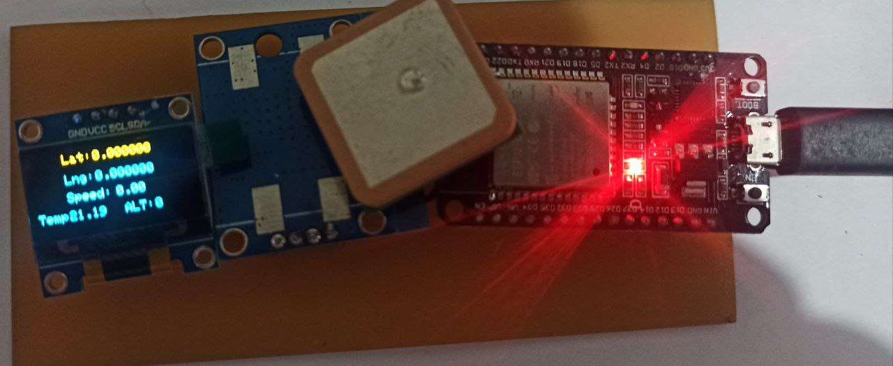
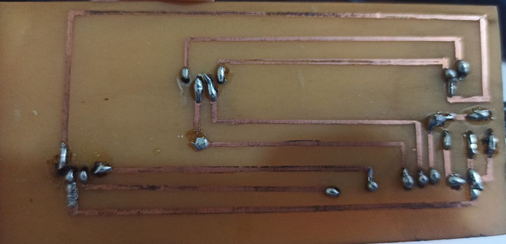
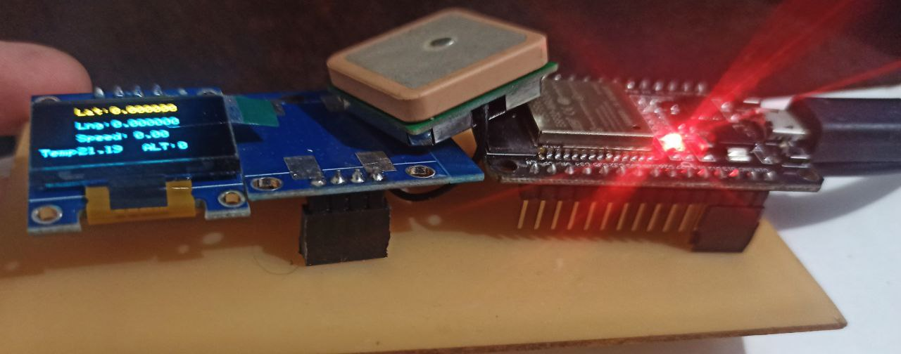

# 3- Circuit Design
To build the sensor device, you can use a protoboard, only wire jumpers, PCB boads (printed circuits), etc. Below there is the design of the circuit.

<!--  -->

This is the final version of circuit, you can use another power source ex: battery 9v. In this case, we are using a power banking.
On the image, each sensor (temperature, gps, display) has a specific voltage (3.3v or 5v) and connects to specific pins on ESP32. For example, termometer is connected to D4 pin.

We develop a final version of the board, we draw a circuit and printed it manually in a phenolite board as the image bellow.

 

 

 

## a. Tips
- **GPS:** If you are testing GPS, keep the antenna ceramic part face up as the previous image. The GPS can take a while to find satellites, try to go far from buildings or keep the sensor near the window if you leave in apartment.
- **Termometer:** if the circuit restart the measure of termometer can stuck in a low ou high temperature.
    - https://forum.arduino.cc/t/ds18b20-temp-sensor-reads-correctly-until-arduino-is-rebooted/405062/4
    - https://www.az-delivery.de/en/blogs/azdelivery-blog-fur-arduino-und-raspberry-pi/esp32-daten-und-einstellungen-dauerhaft-speichern
    - https://forum.arduino.cc/t/why-does-this-fix-work-for-ds18b20-error-code-85/529580/13

## b. Links to support you

### GPS Sensor
- 
- https://randomnerdtutorials.com/guide-to-neo-6m-gps-module-with-arduino/
- https://www.youtube.com/watch?v=VOJUV18BYE0 (almost the same circuit)
- https://github.com/ahmadlogs/arduino-ide-examples/tree/main/esp32-gps-tracker (github of the previous link)
- http://freenmea.net/decoder
- https://www.u-blox.com/sites/default/files/products/documents/NEO-6_DataSheet_(GPS.G6-HW-09005).pdf
- http://arduiniana.org/libraries/tinygpsplus/ 

### Termometer
- https://randomnerdtutorials.com/esp32-ds18b20-temperature-arduino-ide/
- https://i2.wp.com/randomnerdtutorials.com/wp-content/uploads/2018/08/ESP32-DOIT-DEVKIT-V1-Board-Pinout-36-GPIOs-updated.jpg?quality=100&strip=all&ssl=1
- https://randomnerdtutorials.com/esp32-ds18b20-temperature-arduino-ide/

### OLED Display
- https://randomnerdtutorials.com/esp32-ssd1306-oled-display-arduino-ide/

# 4- Software part
Putting all together, to collect the data with your sensor, deploy the [code developed](https://github.com/caroljunq/builders-fair-2021-e-l-s-a/blob/main/scripts/esp32-sensor-code.ino) - esp32-sensor-code.ino on [scripts folder ](https://github.com/caroljunq/builders-fair-2021-e-l-s-a/blob/main/scripts/esp32-sensor-code.ino).

The script includes the connection with AWS cloud, but we can comment them to test before connect to AWS or if you do not have an AWS account.

Some data like WIFI name ssid and password are stored in a [secrets.h](https://github.com/caroljunq/builders-fair-2021-e-l-s-a/blob/main/scripts/secrets.h) on scripts folder. It is a way to store information, but there are other strategies that follow best practices to better secure your data and connection ex: hardware module to use with ESP32.

**NEXT MODULE -->** [Connect to AWS Cloud](https://github.com/caroljunq/builders-fair-2021-e-l-s-a/blob/main/iot/3-connecting-with-aws.md)